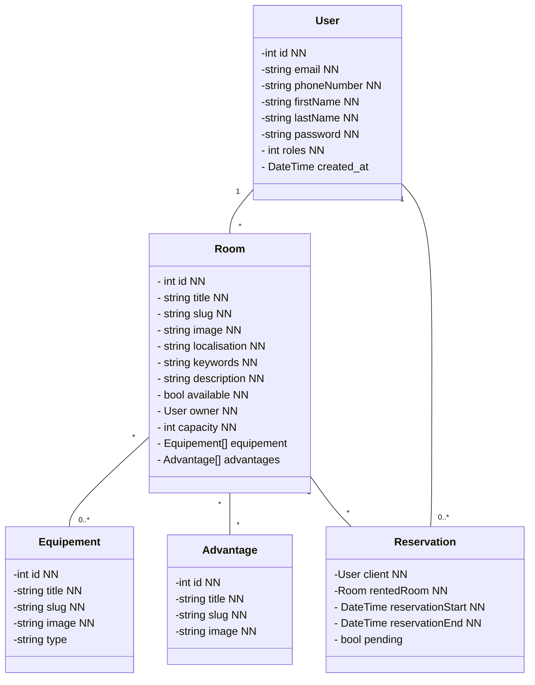

## Database models




## Controller


# Services


# Event Listener

```mermaid

classDiagram


class ReservationListener{
    -onReservationCreated()
    -onReservationValidated()
    -onReservationDeleted()
    -onReservationUpdated()
}

class UserListener{
       -onUserLogin()
    -onUserValidated()
}